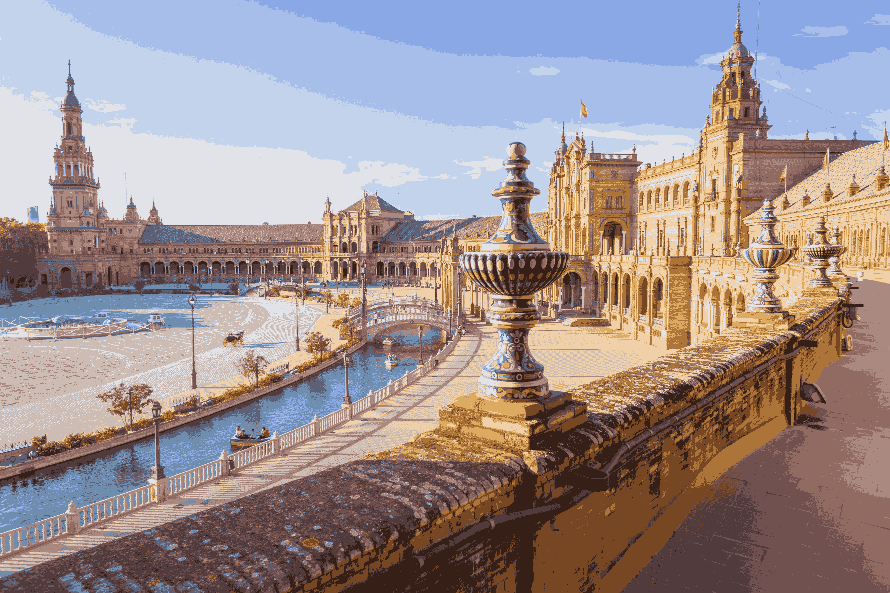

# Image compression using K-means clustering

OpenCL alghoritm for a parallel computing college course. 

## Compile
1. `module load CUDA`
2. `gcc -o gpu gpu.c -fopenmp -O2 -lm -lOpenCL -Wl,-rpath,./ -L./ -l:libfreeimage.so.3`

## Run 
`./gpu input_image.png -K 42 -I 60`

## Program arguments
`input_image [output_image] [-K clusters] [-I iterations]`

The input image should be in .png format.

## Examples

K=64

K=32

K=16
